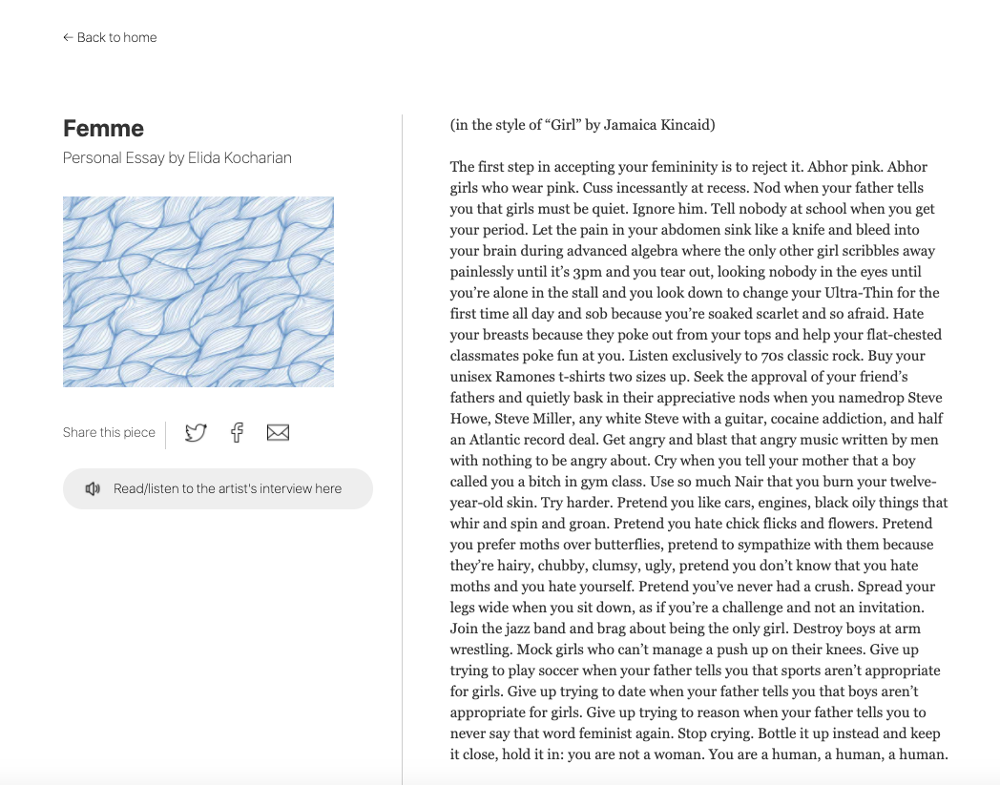
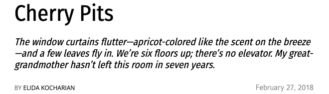

## Aliens, Astrobiology, and Spaces of Migration
_A conversation between Elida Kocharian and Erick Oduniyi_
   
   
   
   
   
   
   
   
   
   
   
   
   
 
   
   
   
   
   
   
   
   
   
   
   
   
   
 
### Friends Don’t Let Friends Go to Space Alone:
_Unless they want to, I guess._

* What does it mean to be a child of migrants? 
  * How does alienation feel compared to what it might feel like for the actual migrants themselves?
* Is space science a form of migration or colonization? 
  * How can we tell? 
  * Who gets to decide?
* What is an alien? 
  * What does life actually mean, and how can we search for life outside of our spaces on Earth?
   
   
   
   
   
   
   
   
   
   
   
   
   
 
   
   
   
   
   
   
   
   
   
   
   
   
   
   
#### femme:
 
[->](https://womens.theharvardadvocate.com/femme)

#### cherry
 
[->](https://www.thecrimson.com/article/2018/2/27/cherry-pits-endpaper/)
   
   
   
   
   
   
   
   
   
   
   
   
   
 
   
   
   
   
   
   
   
   
   
   
   
   
   
 

## Letters From Armenia
                                                                                
  ............................................................................. 
  ........................................@.................................... 
  .....................................@%...../................................ 
  ............................................................................. 
  .................................@....*.&@&,&...@............................ 
  ..@.............................................     @.@..&....%.@*,,@..&@%.. 
  ....@@.........................../........          ......................... 
  ....................#.   *@............             .....#................... 
  .................                ..                   ....  ................. 
  .................,                               #,@(,&     @................ 
  .................&                                            ............... 
  .................                                           @................ 
  ...............                                             @................ 
  ..............                                              @................ 
  ..@         #                                       ,,,        .............. 
  ..........,                                                     /............ 
  ..........@                                                       @/......... 
  ...........*                                    @/@&@@               ...../.. 
  ...............%                                                **#/   ....@. 
  ....................                            & ,@                   ..,... 
  ......................                     /@@@  @ @&(@@               ...... 
  .........................                                              ...... 
  ..........................@   [@](https://www.thecrimson.com/article/2020/10/2/kocharian-rostomian-saint-armenia-two-battles/)......     %%                             %... 
  ....@.....@................................                             /.... 
  ........................................@                              #..... 
  ............*....@@@@@#%.@@(@..........  /                             @..... 
  ...........@........................                                    @..,, 
  ....................................,                                   @,,,, 
  ...............@.........................@                          (,,,,,,,, 
  ...................@......................                       ,,,,,,,,,,,, 
  ...................@..........................                  ,,,,,,,,,,,,, 
  .&&,..@@@/@@#.@@@@.@..................  @ *                   @,,,,,,,,,,,,,, 
  ....................@...................               ,,,,,,,,,,,,,,,,,,,,,, 
  ..........................................           ,,,,,,,,,,,,,,,,,,,,,,,, 
  ..........................................@        ,,,,,,,,,,,,,,,,,,,,,,,,,, 
  ........................#.................      @,,,,,,,,,,,,,,,,,,,,,,,,,,,, 
  @@*......................................      ,,,,,,,,,,,,,,,,,,,,,,,,,,,,,, 
  ,,,,,,,,,,,@.............,.......@,,@.....@ &,,@@/#,,*,,,,,,,,,,,,,,,,,,,,,,, 
  ,,,,,,,,,,,,,,,,,,,,,,,,,.@..,,,,,,,,,,,,,,,,,,,,,,,,,,,,,,,,,,,,,,,,,,,,,,,,                        
